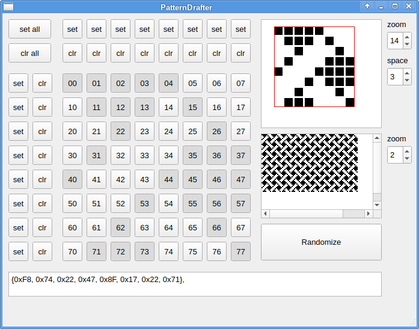

# PatternDrafter
A utility program called [`PatternDrafter`](src/PatternDrafter/patterndrafter.cpp)
is provided in this repository.

It is a program to create 8x8 black/white pixel patterns as used in Apple QuickDraw ,
such as this one:

into a one-byte-per-row binary representation.

Here is how the GUI looks like:

